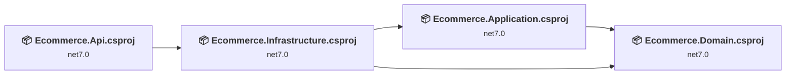
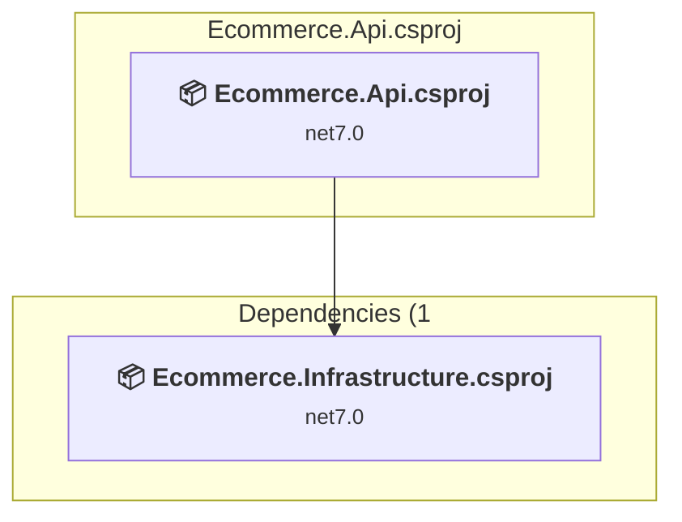
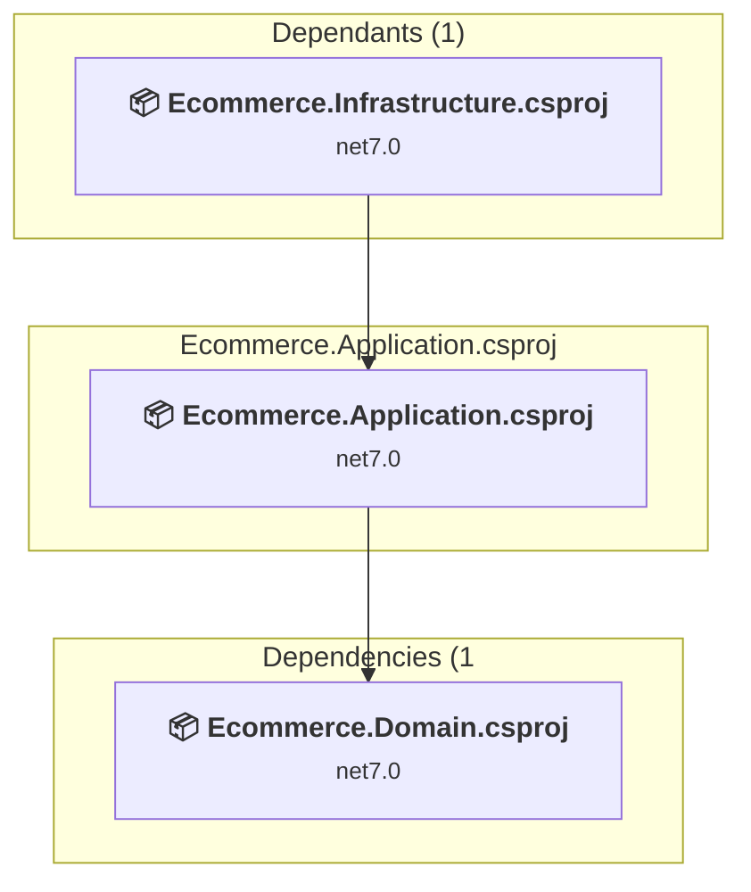
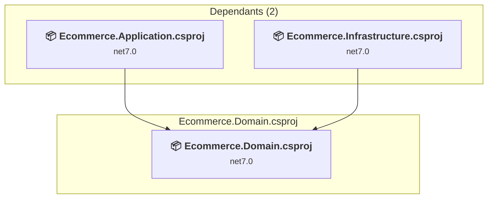
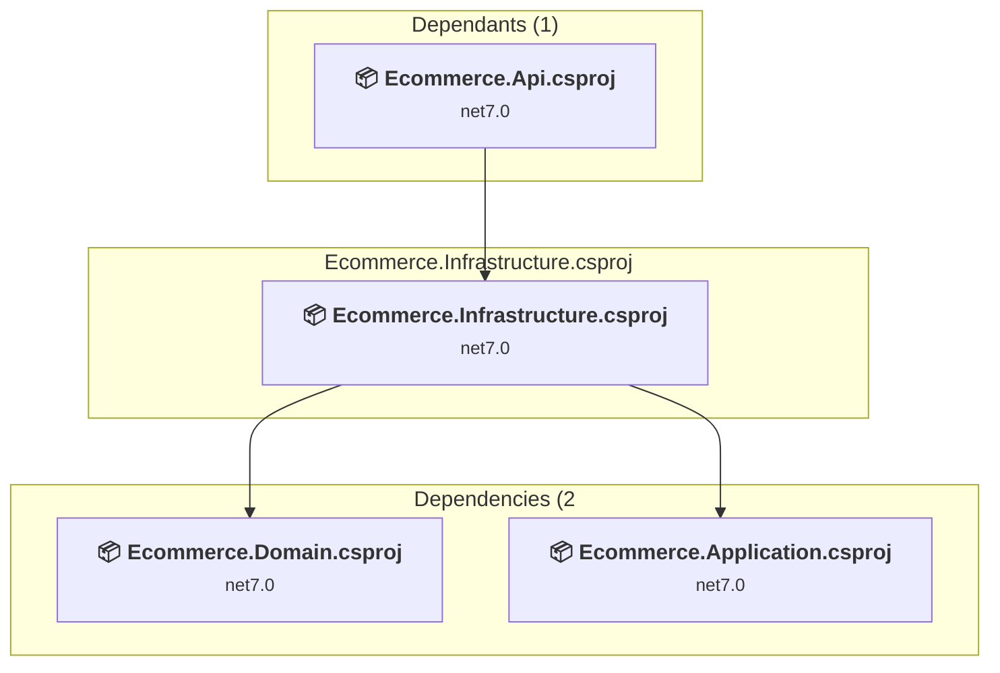

# Projects and dependencies analysis

This document provides a comprehensive overview of the projects and their dependencies in the context of upgrading to .NETCoreApp,Version=v8.0.

## Table of Contents

- [Executive Summary](#executive-Summary)
  - [Highlevel Metrics](#highlevel-metrics)
  - [Projects Compatibility](#projects-compatibility)
  - [Package Compatibility](#package-compatibility)
  - [API Compatibility](#api-compatibility)
  - [Binding Redirect Configuration](#binding-redirect-configuration)
- [Aggregate NuGet packages details](#aggregate-nuget-packages-details)
- [Top API Migration Challenges](#top-api-migration-challenges)
  - [Technologies and Features](#technologies-and-features)
  - [Most Frequent API Issues](#most-frequent-api-issues)
- [Projects Relationship Graph](#projects-relationship-graph)
- [Project Details](#project-details)

  - [src\Api\Ecommerce.Api\Ecommerce.Api.csproj](#srcapiecommerceapiecommerceapicsproj)
  - [src\Core\Ecommerce.Application\Ecommerce.Application\Ecommerce.Application.csproj](#srccoreecommerceapplicationecommerceapplicationecommerceapplicationcsproj)
  - [src\Core\Ecommerce.Domain\Ecommerce.Domain\Ecommerce.Domain.csproj](#srccoreecommercedomainecommercedomainecommercedomaincsproj)
  - [src\Infrastructure\Ecommerce.Infrastructure\Ecommerce.Infrastructure.csproj](#srcinfrastructureecommerceinfrastructureecommerceinfrastructurecsproj)

## Executive Summary

### Highlevel Metrics

| Metric | Count | Status |
| :--- | :---: | :--- |
| Total Projects | 4 | All require upgrade |
| Total NuGet Packages | 26 | 18 need upgrade |
| Total Code Files | 290 |  |
| Total Code Files with Incidents | 6 |  |
| Total Lines of Code | 20249 |  |
| Total Number of Issues | 45 |  |
| Estimated LOC to modify | 14+ | at least 0.1% of codebase |

### Projects Compatibility

| Project | Target Framework | Difficulty | Package Issues | API Issues | Binding Issues | Est. LOC Impact | Description |
| :--- | :---: | :---: | :---: | :---: | :---: | :---: | :--- |
| [src\Api\Ecommerce.Api\Ecommerce.Api.csproj](#srcapiecommerceapiecommerceapicsproj) | net7.0 | 🟢 Low | 2 | 8 | 0 | 8+ | AspNetCore, Sdk Style = True |
| [src\Core\Ecommerce.Application\Ecommerce.Application\Ecommerce.Application.csproj](#srccoreecommerceapplicationecommerceapplicationecommerceapplicationcsproj) | net7.0 | 🟢 Low | 15 | 0 | 0 |  | ClassLibrary, Sdk Style = True |
| [src\Core\Ecommerce.Domain\Ecommerce.Domain\Ecommerce.Domain.csproj](#srccoreecommercedomainecommercedomainecommercedomaincsproj) | net7.0 | 🟢 Low | 2 | 0 | 0 |  | ClassLibrary, Sdk Style = True |
| [src\Infrastructure\Ecommerce.Infrastructure\Ecommerce.Infrastructure.csproj](#srcinfrastructureecommerceinfrastructureecommerceinfrastructurecsproj) | net7.0 | 🟢 Low | 8 | 6 | 0 | 6+ | ClassLibrary, Sdk Style = True |

### Package Compatibility

| Status | Count | Percentage |
| :--- | :---: | :---: |
| ✅ Compatible | 8 | 30.8% |
| ⚠️ Incompatible | 4 | 15.4% |
| 🔄 Upgrade Recommended | 14 | 53.8% |
| ***Total NuGet Packages*** | ***26*** | ***100%*** |

### API Compatibility

| Category | Count | Impact |
| :--- | :---: | :--- |
| 🔴 Binary Incompatible | 7 | High - Require code changes |
| 🟡 Source Incompatible | 7 | Medium - Needs re-compilation and potential conflicting API error fixing |
| 🔵 Behavioral change | 0 | Low - Behavioral changes that may require testing at runtime |
| ✅ Compatible | 24053 |  |
| ***Total APIs Analyzed*** | ***24067*** |  |

## Aggregate NuGet packages details

| Package | Current Version | Suggested Version | Projects | Description |
| :--- | :---: | :---: | :--- | :--- |
| AutoMapper | 12.0.1 | 16.2.0 | [Ecommerce.Application.csproj](#srccoreecommerceapplicationecommerceapplicationecommerceapplicationcsproj) | El paquete NuGet contiene una vulnerabilidad de seguridad. |
| AutoMapper.Extensions.Microsoft.DependencyInjection | 12.0.1 |  | [Ecommerce.Application.csproj](#srccoreecommerceapplicationecommerceapplicationecommerceapplicationcsproj) | ⚠️El paquete NuGet está en desuso |
| CloudinaryDotNet | 1.20.0 |  | [Ecommerce.Application.csproj](#srccoreecommerceapplicationecommerceapplicationecommerceapplicationcsproj) | ✅Compatible |
| FluentValidation | 11.5.2 |  | [Ecommerce.Application.csproj](#srccoreecommerceapplicationecommerceapplicationecommerceapplicationcsproj) | ✅Compatible |
| FluentValidation.AspNetCore | 11.3.0 |  | [Ecommerce.Application.csproj](#srccoreecommerceapplicationecommerceapplicationecommerceapplicationcsproj) | ⚠️El paquete NuGet está en desuso |
| FluentValidation.DependencyInjectionExtensions | 11.5.2 |  | [Ecommerce.Application.csproj](#srccoreecommerceapplicationecommerceapplicationecommerceapplicationcsproj) | ✅Compatible |
| glovo.client.csharp | 1.5.0 |  | [Ecommerce.Application.csproj](#srccoreecommerceapplicationecommerceapplicationecommerceapplicationcsproj) [Ecommerce.Infrastructure.csproj](#srcinfrastructureecommerceinfrastructureecommerceinfrastructurecsproj) | ✅Compatible |
| MailKit | 3.6.0 | 4.17.0 | [Ecommerce.Application.csproj](#srccoreecommerceapplicationecommerceapplicationecommerceapplicationcsproj) | El paquete NuGet contiene una vulnerabilidad de seguridad. |
| MediatR | 12.0.1 |  | [Ecommerce.Application.csproj](#srccoreecommerceapplicationecommerceapplicationecommerceapplicationcsproj) | ✅Compatible |
| Microsoft.AspNetCore.Authentication.JwtBearer | 7.0.5 | 8.0.29 | [Ecommerce.Application.csproj](#srccoreecommerceapplicationecommerceapplicationecommerceapplicationcsproj) | Se recomienda actualizar el paquete NuGet |
| Microsoft.AspNetCore.Authentication.OpenIdConnect | 7.0.5 | 8.0.29 | [Ecommerce.Infrastructure.csproj](#srcinfrastructureecommerceinfrastructureecommerceinfrastructurecsproj) | Se recomienda actualizar el paquete NuGet |
| Microsoft.AspNetCore.Identity | 2.2.0 |  | [Ecommerce.Application.csproj](#srccoreecommerceapplicationecommerceapplicationecommerceapplicationcsproj) [Ecommerce.Domain.csproj](#srccoreecommercedomainecommercedomainecommercedomaincsproj) | ⚠️El paquete NuGet está en desuso |
| Microsoft.AspNetCore.Identity.EntityFrameworkCore | 7.0.5 | 8.0.29 | [Ecommerce.Application.csproj](#srccoreecommerceapplicationecommerceapplicationecommerceapplicationcsproj) [Ecommerce.Domain.csproj](#srccoreecommercedomainecommercedomainecommercedomaincsproj) [Ecommerce.Infrastructure.csproj](#srcinfrastructureecommerceinfrastructureecommerceinfrastructurecsproj) | Se recomienda actualizar el paquete NuGet |
| Microsoft.AspNetCore.OpenApi | 7.0.5 | 8.0.29 | [Ecommerce.Api.csproj](#srcapiecommerceapiecommerceapicsproj) [Ecommerce.Application.csproj](#srccoreecommerceapplicationecommerceapplicationecommerceapplicationcsproj) | Se recomienda actualizar el paquete NuGet |
| Microsoft.EntityFrameworkCore | 7.0.5 | 8.0.29 | [Ecommerce.Infrastructure.csproj](#srcinfrastructureecommerceinfrastructureecommerceinfrastructurecsproj) | Se recomienda actualizar el paquete NuGet |
| Microsoft.EntityFrameworkCore.Design | 7.0.5 | 8.0.29 | [Ecommerce.Api.csproj](#srcapiecommerceapiecommerceapicsproj) [Ecommerce.Application.csproj](#srccoreecommerceapplicationecommerceapplicationecommerceapplicationcsproj) | Se recomienda actualizar el paquete NuGet |
| Microsoft.EntityFrameworkCore.SqlServer | 7.0.5 | 8.0.29 | [Ecommerce.Application.csproj](#srccoreecommerceapplicationecommerceapplicationecommerceapplicationcsproj) [Ecommerce.Infrastructure.csproj](#srcinfrastructureecommerceinfrastructureecommerceinfrastructurecsproj) | Se recomienda actualizar el paquete NuGet |
| Microsoft.EntityFrameworkCore.Tools | 7.0.5 | 8.0.29 | [Ecommerce.Application.csproj](#srccoreecommerceapplicationecommerceapplicationecommerceapplicationcsproj) [Ecommerce.Infrastructure.csproj](#srcinfrastructureecommerceinfrastructureecommerceinfrastructurecsproj) | Se recomienda actualizar el paquete NuGet |
| Microsoft.Extensions.Http | 7.0.0 | 8.0.1 | [Ecommerce.Application.csproj](#srccoreecommerceapplicationecommerceapplicationecommerceapplicationcsproj) | Se recomienda actualizar el paquete NuGet |
| Microsoft.Extensions.Logging.Abstractions | 7.0.0 | 8.0.3 | [Ecommerce.Application.csproj](#srccoreecommerceapplicationecommerceapplicationecommerceapplicationcsproj) | Se recomienda actualizar el paquete NuGet |
| Microsoft.Extensions.Options.ConfigurationExtensions | 7.0.0 | 8.0.0 | [Ecommerce.Application.csproj](#srccoreecommerceapplicationecommerceapplicationecommerceapplicationcsproj) [Ecommerce.Infrastructure.csproj](#srcinfrastructureecommerceinfrastructureecommerceinfrastructurecsproj) | Se recomienda actualizar el paquete NuGet |
| Newtonsoft.Json | 13.0.3 | 13.0.4 | [Ecommerce.Infrastructure.csproj](#srcinfrastructureecommerceinfrastructureecommerceinfrastructurecsproj) | Se recomienda actualizar el paquete NuGet |
| SendGrid | 9.28.1 |  | [Ecommerce.Application.csproj](#srccoreecommerceapplicationecommerceapplicationecommerceapplicationcsproj) | ✅Compatible |
| Stripe.net | 41.13.0 |  | [Ecommerce.Application.csproj](#srccoreecommerceapplicationecommerceapplicationecommerceapplicationcsproj) | ✅Compatible |
| Swashbuckle.AspNetCore | 6.5.0 |  | [Ecommerce.Api.csproj](#srcapiecommerceapiecommerceapicsproj) [Ecommerce.Application.csproj](#srccoreecommerceapplicationecommerceapplicationecommerceapplicationcsproj) | ✅Compatible |
| System.IdentityModel.Tokens.Jwt | 6.35.0 |  | [Ecommerce.Application.csproj](#srccoreecommerceapplicationecommerceapplicationecommerceapplicationcsproj) [Ecommerce.Infrastructure.csproj](#srcinfrastructureecommerceinfrastructureecommerceinfrastructurecsproj) | ⚠️El paquete NuGet está en desuso |

## Top API Migration Challenges

### Technologies and Features

| Technology | Issues | Percentage | Migration Path |
| :--- | :---: | :---: | :--- |
| IdentityModel & Claims-based Security | 6 | 42.9% | Windows Identity Foundation (WIF), SAML, and claims-based authentication APIs that have been replaced by modern identity libraries. WIF was the original identity framework for .NET Framework. Migrate to Microsoft.IdentityModel.* packages (modern identity stack). |

### Most Frequent API Issues

| API | Count | Percentage | Category |
| :--- | :---: | :---: | :--- |
| P:Microsoft.AspNetCore.Authentication.JwtBearer.JwtBearerOptions.TokenValidationParameters | 1 | 7.1% | Source Incompatible |
| T:Microsoft.AspNetCore.Authentication.JwtBearer.JwtBearerDefaults | 1 | 7.1% | Source Incompatible |
| F:Microsoft.AspNetCore.Authentication.JwtBearer.JwtBearerDefaults.AuthenticationScheme | 1 | 7.1% | Source Incompatible |
| T:Microsoft.Extensions.DependencyInjection.JwtBearerExtensions | 1 | 7.1% | Source Incompatible |
| M:Microsoft.Extensions.DependencyInjection.JwtBearerExtensions.AddJwtBearer(Microsoft.AspNetCore.Authentication.AuthenticationBuilder,System.Action{Microsoft.AspNetCore.Authentication.JwtBearer.JwtBearerOptions}) | 1 | 7.1% | Source Incompatible |
| T:Microsoft.Extensions.DependencyInjection.IdentityEntityFrameworkBuilderExtensions | 1 | 7.1% | Source Incompatible |
| M:Microsoft.Extensions.DependencyInjection.IdentityEntityFrameworkBuilderExtensions.AddEntityFrameworkStores''1(Microsoft.AspNetCore.Identity.IdentityBuilder) | 1 | 7.1% | Source Incompatible |
| T:Microsoft.Extensions.DependencyInjection.ServiceCollectionExtensions | 1 | 7.1% | Binary Incompatible |
| M:System.IdentityModel.Tokens.Jwt.JwtSecurityTokenHandler.WriteToken(Microsoft.IdentityModel.Tokens.SecurityToken) | 1 | 7.1% | Binary Incompatible |
| M:System.IdentityModel.Tokens.Jwt.JwtSecurityTokenHandler.CreateToken(Microsoft.IdentityModel.Tokens.SecurityTokenDescriptor) | 1 | 7.1% | Binary Incompatible |
| T:System.IdentityModel.Tokens.Jwt.JwtSecurityTokenHandler | 1 | 7.1% | Binary Incompatible |
| M:System.IdentityModel.Tokens.Jwt.JwtSecurityTokenHandler.#ctor | 1 | 7.1% | Binary Incompatible |
| T:System.IdentityModel.Tokens.Jwt.JwtRegisteredClaimNames | 1 | 7.1% | Binary Incompatible |
| F:System.IdentityModel.Tokens.Jwt.JwtRegisteredClaimNames.NameId | 1 | 7.1% | Binary Incompatible |

## Projects Relationship Graph

Legend:
📦 SDK-style project
⚙️ Classic project

## Project Details

### src\Api\Ecommerce.Api\Ecommerce.Api.csproj

#### Project Info

- **Current Target Framework:** net7.0
- **Proposed Target Framework:** net8.0
- **SDK-style**: True
- **Project Kind:** AspNetCore
- **Dependencies**: 1
- **Dependants**: 0
- **Number of Files**: 17
- **Number of Files with Incidents**: 2
- **Lines of Code**: 1094
- **Estimated LOC to modify**: 8+ (at least 0.7% of the project)

#### Dependency Graph

Legend:
📦 SDK-style project
⚙️ Classic project

### API Compatibility

| Category | Count | Impact |
| :--- | :---: | :--- |
| 🔴 Binary Incompatible | 1 | High - Require code changes |
| 🟡 Source Incompatible | 7 | Medium - Needs re-compilation and potential conflicting API error fixing |
| 🔵 Behavioral change | 0 | Low - Behavioral changes that may require testing at runtime |
| ✅ Compatible | 1368 |  |
| ***Total APIs Analyzed*** | ***1376*** |  |

### src\Core\Ecommerce.Application\Ecommerce.Application\Ecommerce.Application.csproj

#### Project Info

- **Current Target Framework:** net7.0
- **Proposed Target Framework:** net8.0
- **SDK-style**: True
- **Project Kind:** ClassLibrary
- **Dependencies**: 1
- **Dependants**: 1
- **Number of Files**: 215
- **Number of Files with Incidents**: 1
- **Lines of Code**: 7242
- **Estimated LOC to modify**: 0+ (at least 0.0% of the project)

#### Dependency Graph

Legend:
📦 SDK-style project
⚙️ Classic project

### API Compatibility

| Category | Count | Impact |
| :--- | :---: | :--- |
| 🔴 Binary Incompatible | 0 | High - Require code changes |
| 🟡 Source Incompatible | 0 | Medium - Needs re-compilation and potential conflicting API error fixing |
| 🔵 Behavioral change | 0 | Low - Behavioral changes that may require testing at runtime |
| ✅ Compatible | 6511 |  |
| ***Total APIs Analyzed*** | ***6511*** |  |

### src\Core\Ecommerce.Domain\Ecommerce.Domain\Ecommerce.Domain.csproj

#### Project Info

- **Current Target Framework:** net7.0
- **Proposed Target Framework:** net8.0
- **SDK-style**: True
- **Project Kind:** ClassLibrary
- **Dependencies**: 0
- **Dependants**: 2
- **Number of Files**: 28
- **Number of Files with Incidents**: 1
- **Lines of Code**: 781
- **Estimated LOC to modify**: 0+ (at least 0.0% of the project)

#### Dependency Graph

Legend:
📦 SDK-style project
⚙️ Classic project

### API Compatibility

| Category | Count | Impact |
| :--- | :---: | :--- |
| 🔴 Binary Incompatible | 0 | High - Require code changes |
| 🟡 Source Incompatible | 0 | Medium - Needs re-compilation and potential conflicting API error fixing |
| 🔵 Behavioral change | 0 | Low - Behavioral changes that may require testing at runtime |
| ✅ Compatible | 711 |  |
| ***Total APIs Analyzed*** | ***711*** |  |

### src\Infrastructure\Ecommerce.Infrastructure\Ecommerce.Infrastructure.csproj

#### Project Info

- **Current Target Framework:** net7.0
- **Proposed Target Framework:** net8.0
- **SDK-style**: True
- **Project Kind:** ClassLibrary
- **Dependencies**: 2
- **Dependants**: 1
- **Number of Files**: 34
- **Number of Files with Incidents**: 2
- **Lines of Code**: 11132
- **Estimated LOC to modify**: 6+ (at least 0.1% of the project)

#### Dependency Graph

Legend:
📦 SDK-style project
⚙️ Classic project

### API Compatibility

| Category | Count | Impact |
| :--- | :---: | :--- |
| 🔴 Binary Incompatible | 6 | High - Require code changes |
| 🟡 Source Incompatible | 0 | Medium - Needs re-compilation and potential conflicting API error fixing |
| 🔵 Behavioral change | 0 | Low - Behavioral changes that may require testing at runtime |
| ✅ Compatible | 15463 |  |
| ***Total APIs Analyzed*** | ***15469*** |  |

#### Project Technologies and Features

| Technology | Issues | Percentage | Migration Path |
| :--- | :---: | :---: | :--- |
| IdentityModel & Claims-based Security | 6 | 100.0% | Windows Identity Foundation (WIF), SAML, and claims-based authentication APIs that have been replaced by modern identity libraries. WIF was the original identity framework for .NET Framework. Migrate to Microsoft.IdentityModel.* packages (modern identity stack). |

